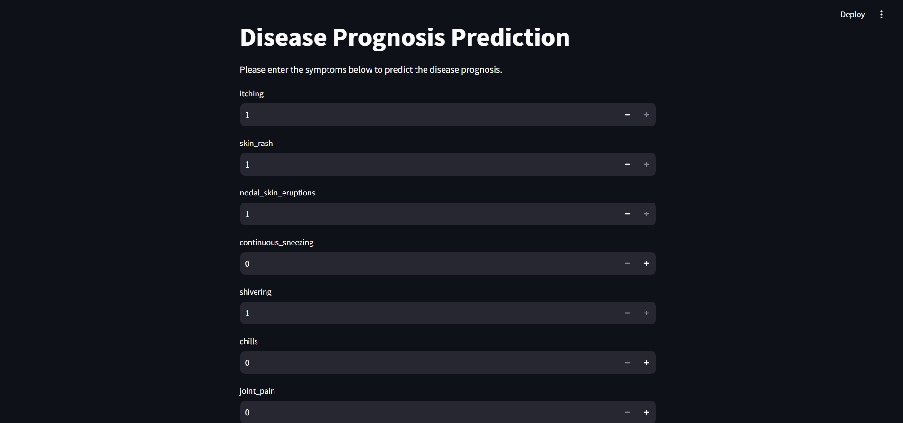
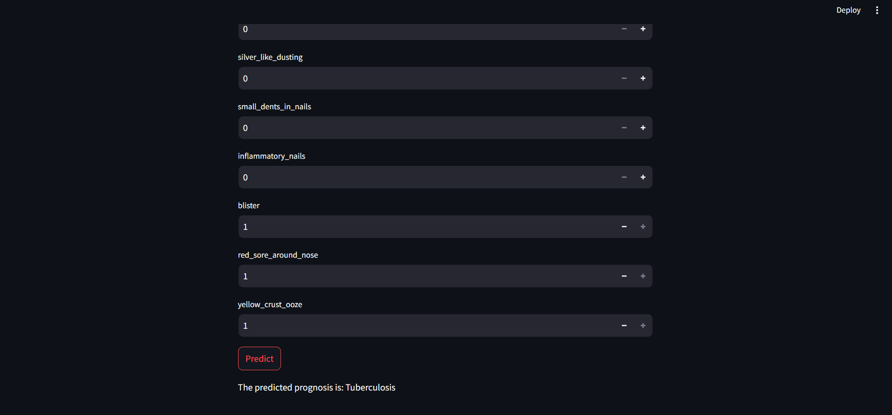

## **Disease Prognosis**

### Screenshot Predicted Output

## **Workflow**

1. Update config.yaml
2. Update schema.yaml
3. Update params.yaml
4. Update the entity
5. Update the configuration manager in src/config
6. Update the components
7. Update the pipeline
8. Update main.py
9. Update app.py

## **Important Note**

- One of the main focuses of this project is modular coding.
- Additionally, the prediction process is a key component.

Happy learning!!!!
